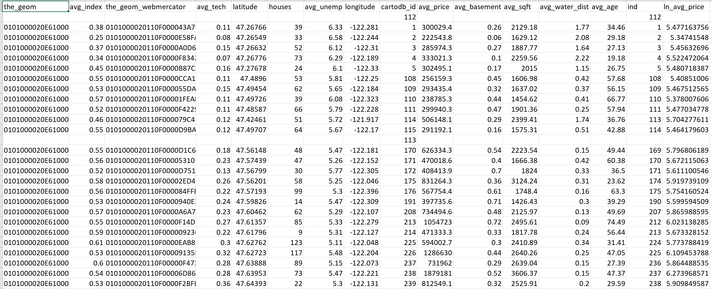
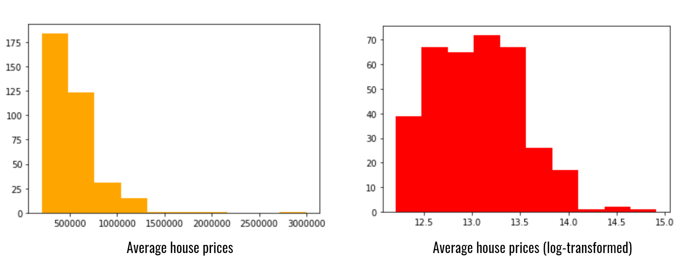
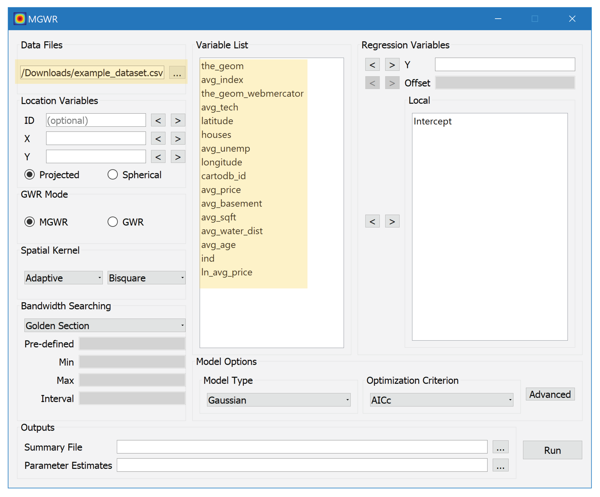
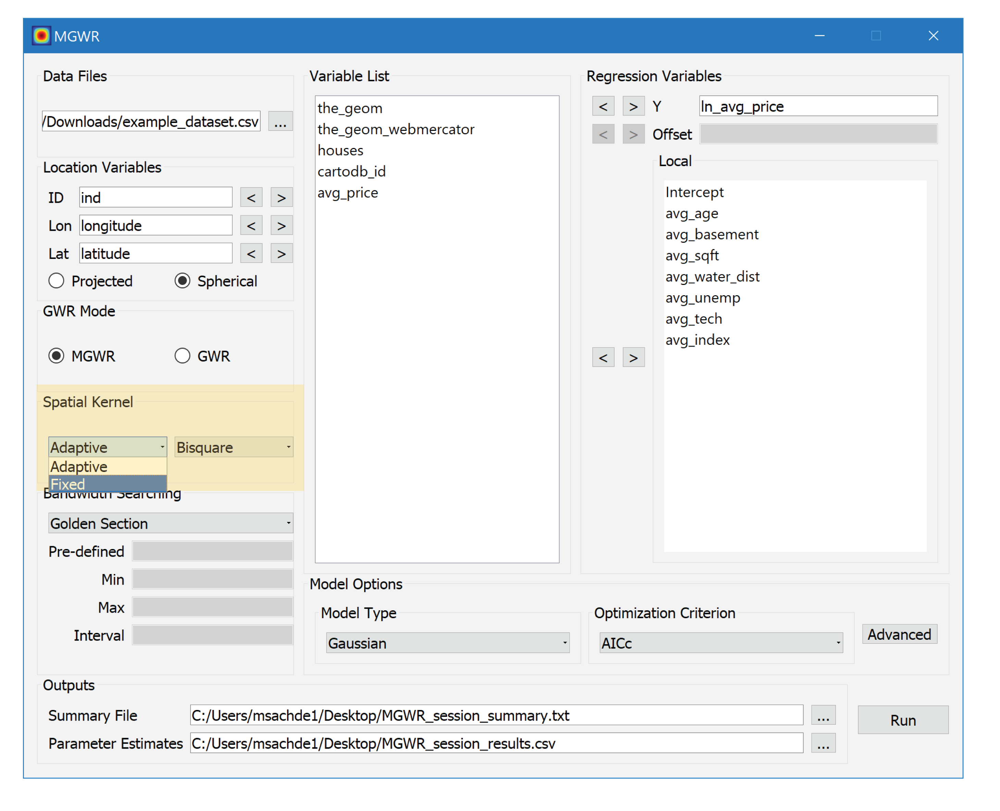
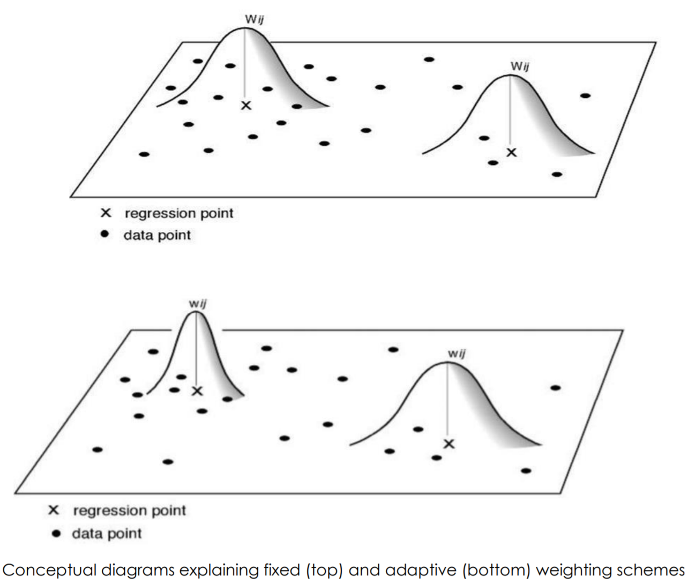
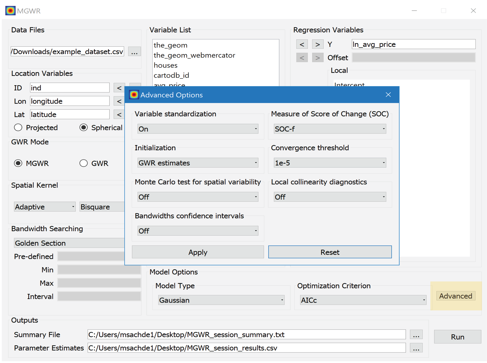

# 
 Hands-on Example with MGWR 

**Notebook Outline:**  
  
**An example of hedonic house price modeling using MGWR**
- [Introduction to the Dataset](#Introduction-to-the-Dataset)
- [Loading the dataset](#Loading-the-Dataset)
- [Spatial Weighting Kernels and other Options](#Spatial-Weighting-Kernels-and-other-Options)   

[Back to the main page](https://mehak-sachdeva.github.io/MGWR_workshop_book/)

# Introduction to the Dataset

***

#### Please use [this link](http://msachdeva.cartodb.com/api/v2/sql?filename=example_dataset&format=csv&q=SELECT+*+FROM+census_tracts_final+as+example_data) to directly download a csv of the dataset

- **houses** - number of houses in the census tracts

**Dependent variables**

- **avg_price** - average house prices in the census tracts
        
        OR

- **ln_avg_price** - log-transformed average house prices in the census tracts

**Independent variables**

- **avg_tech** - average technology related jobs in the census tracts

- **avg_unemp** - average unemployment rate in the census tracts

- **avg_index** - average number of house with a view to the waterfront

- **avg_basement** - average basements in the houses in the census tracts

- **avg_water_dist** - average distance to nearest waterfronts from the houses in the census tracts

- **avg_sqft** - average square footage of living area in houses in the census tracts

- **avg_age** - average age of housing units in the census tracts

#### Dependent variable distribution

#### Hence, we use the log-transformed dependent variable *ln_avg_price*

# Loading the Dataset

Open the [MGWR GUI software](https://sgsup.asu.edu/sparc/mgwr) on your desktop to follow along!

At this stage I am going to do the steps elaborated below live. The screenshots of the steps below will guide you if you need additional reference.

### 1. Loading the dataset and variables

### 2. Load the dependent and independent variables

# Spatial Weighting Kernels and other Options

### Advanced options

***
