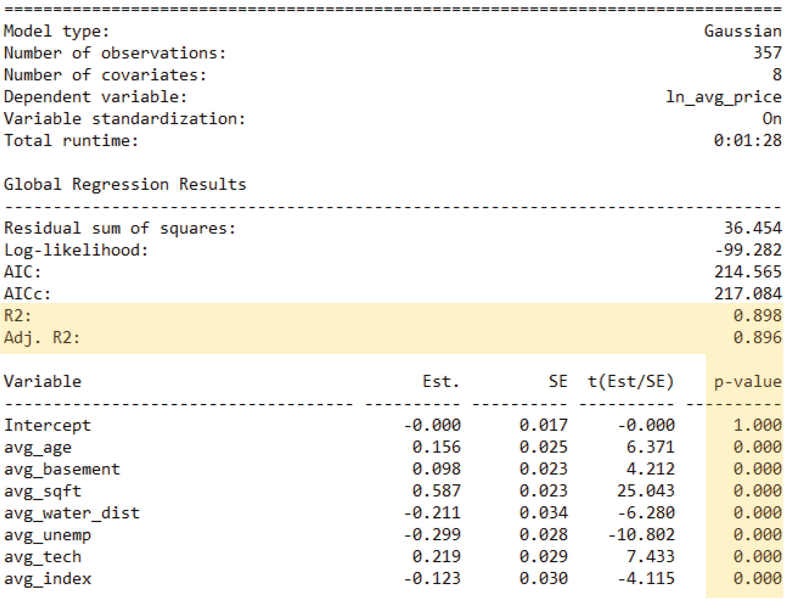
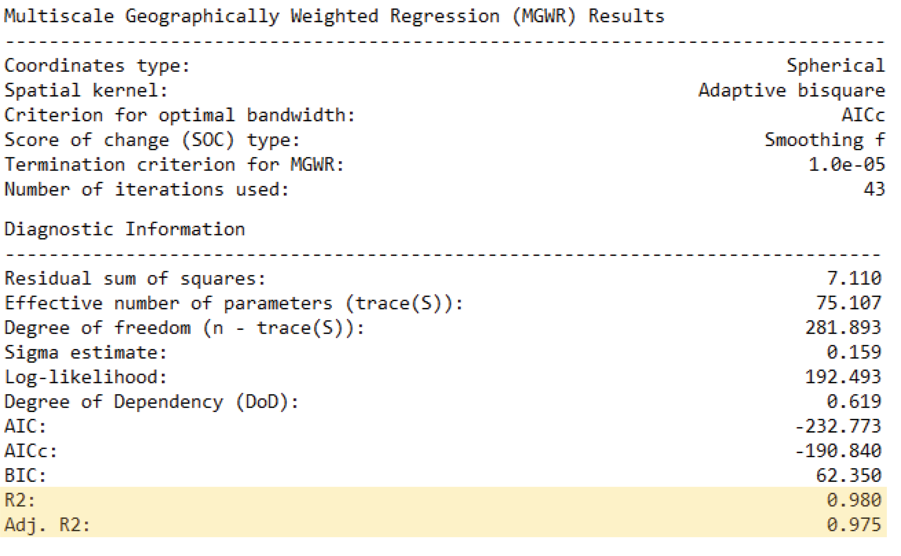
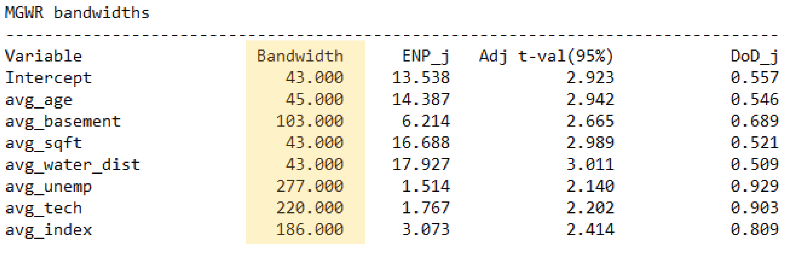
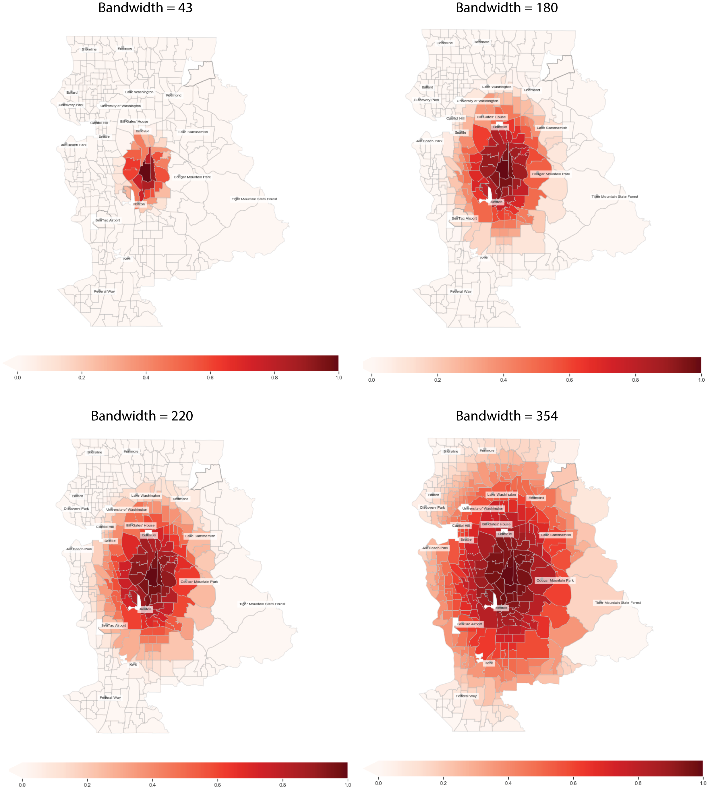
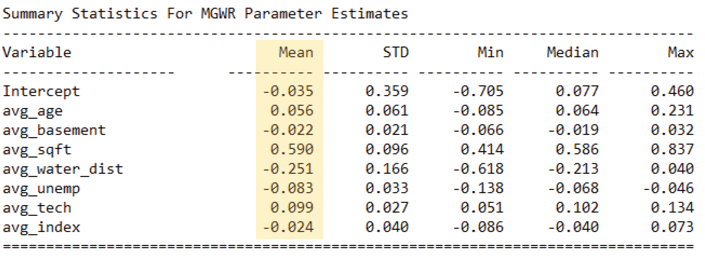

# 
 Interpretation and Understanding Outputs 

**Notebook Outline:**  
  
**An example of hedonic house price modeling using MGWR**
- [Global Model Results](#Global-Model-Results)
- [MGWR Results - Model Fit](#MGWR-Results---Model-Fit)
- [MGWR Results - Bandwidth Parameters](#MGWR-Results---Bandwidth-Parameters) 
- [MGWR Results - Parameter Estimates](#MGWR-Results---Parameter-Estimates)  

[Back to the main page](https://mehak-sachdeva.github.io/MGWR_workshop_book/)

# Global Model Results

***

### Global Regression Model Fit and Parameter Estimates

Two files are saved on your computer once you run the MGWR model - **MGWR_session_summary.txt** and **MGWR_session_results.csv**

# MGWR Results - Model Fit

# MGWR Results - Bandwidth Parameters

### Total number of census tracts = 357

### Visualizing bandwidths to understand scale

# MGWR Results - Parameter Estimates

### The new columns added to the results csv: 
1. **ols_residual** - Residuals from OLS model for every location point
2. **mgwr_yhat** - yhat from MGWR for each location point
3. **mgwr_residual** - Residuals from MGWR for every location point
4. **localR2** - Explained variation at each location point
5. **beta_** - Columns starting with *beta* are parameter estimates for the covariates
6. **se_** - Columns starting with *se* are standard errors for estimates for the covariates
7. **t_** - Columns starting with *t* are t values for estimates for the covariates
8. **p_** - Columns starting with *p* are p values for estimates for the covariates
9. **sumW_** - Sum of weights for the covariates at each location

The **beta_** columns need to be filtered to have only the significant parameter estimates. This filtering is done using the **t_** value columns. The thresholds for t values are defined by the **adjusted t values** as shown below.

***
