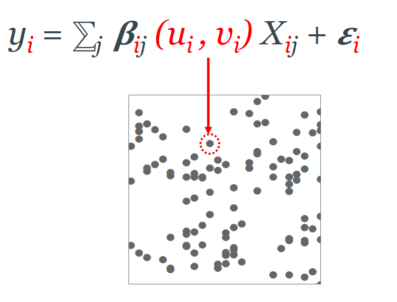
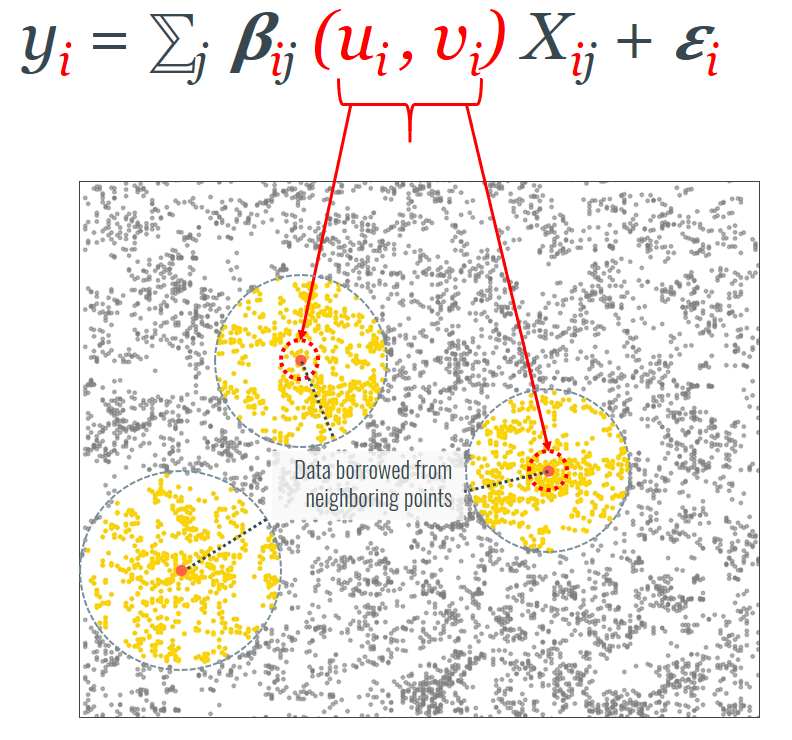
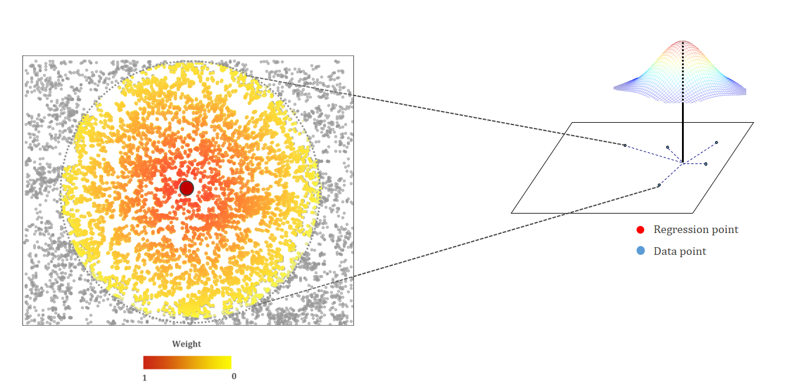
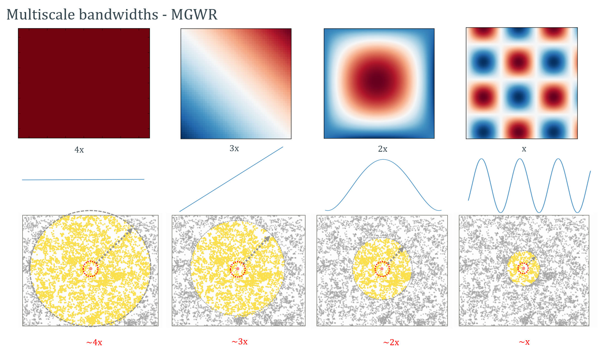

# 
 Methodological Review of GWR and MGWR 

**Notebook Outline:**  
  
**Local Regression Models**
- [Geographically Weighted Regression (GWR)](#Geographically-Weighted-Regression-(GWR))
- [Bandwidth - Indicator of Scale](#Bandwidth---Indicator-of-Scale)
- [**Multiscale** Geographically Weighted Regression (MGWR)](#Multiscale-Geographically-Weighted-Regression)   

[Back to the main page](https://mehak-sachdeva.github.io/MGWR_workshop_book/)

# Geographically Weighted Regression (GWR)

***

Since the global models provide an average coefficient estimate for each predictor variable across the study area, they inherently assume the relationships tp be constant across space. That is however, not always true.
GWR relaxes this assumption and provides a unique coefficient estimate for each location and for each covariate. The GWR model is essentially an ensemble of OLS regressions calibrated at each individual location of the study area which is reflected by the *(ui,vi)* in the equation here.

To calibrate a regression model at each location we would technicaly require multiple unique data points at the same location. Since that kind of data is extemely hard to find, GWR gets around the problem by **borrowing data from geographically neighboring locations**. This is in accordance with **Tobler's Law** of spatial dependence. The number of neighboring data values used to calibrate a model is obtained using an optimization criterion such as AIC or cross-validation and the parameter is called the **bandwidth**. The bandwidth is interpreted as an indicator of scale at which the spatial processes have the most to contribute to the formation of the spatial pattern being examined. 

# Bandwidth - Indicator of Scale

***

<Explanation of bandwidth parameter here>

# **Multiscale** Geographically Weighted Regression

***

Since different processes affect the spatial pattern we observe at different scales (as we saw in the human migration example above!), a recent multiscale extension to GWR was developed. This extension relaxes the assumtion that all processes operate at a single scale and allows the estimation of unique scales of spatial processes in a model. 

In the simulated example below, for example, an MGWR model will potentially be able to estimate an appropriate scale for each process depending on the amount of spatial heterogeneity in each process. MGWR model in effect, produces a bandwidth parameter for each spatial process being modeled.

[Next](http://mehak-sachdeva.github.io/MGWR_workshop_book/Html/Example)

***
