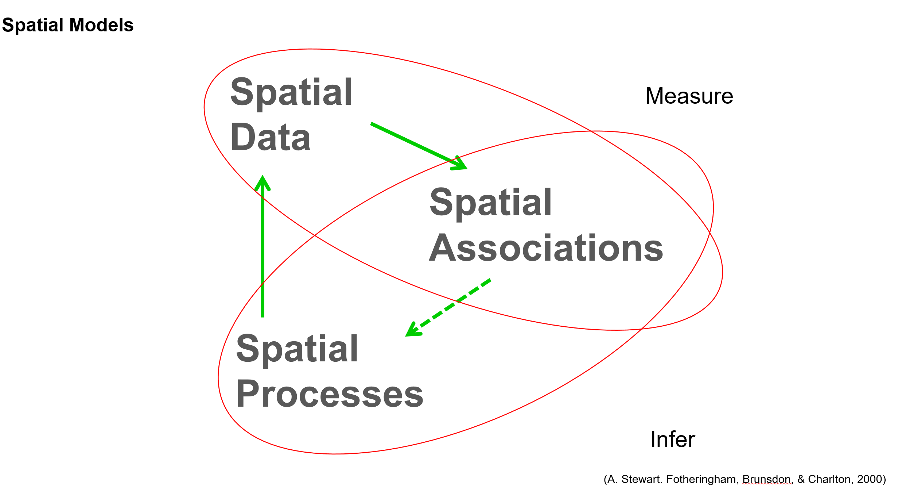
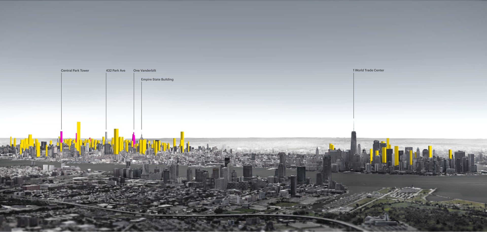
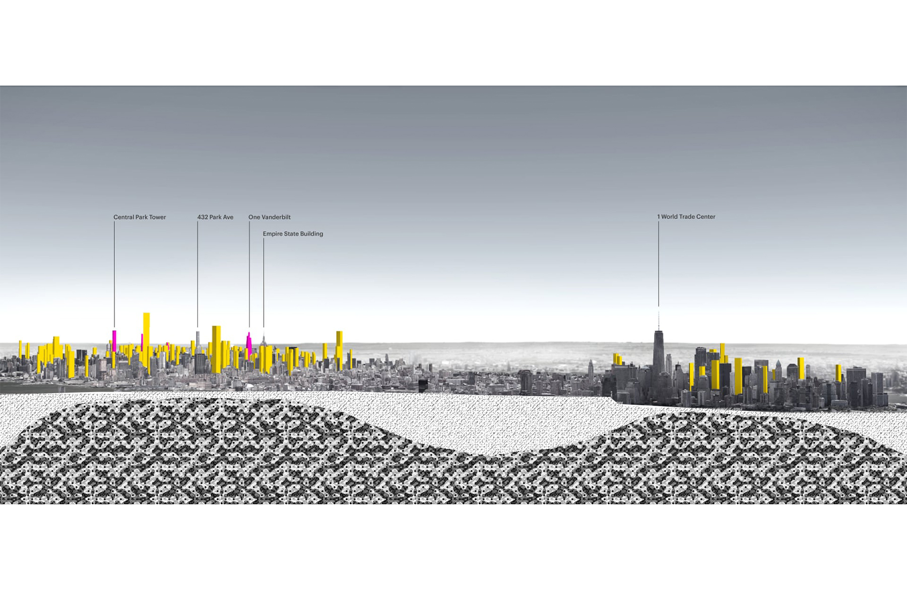
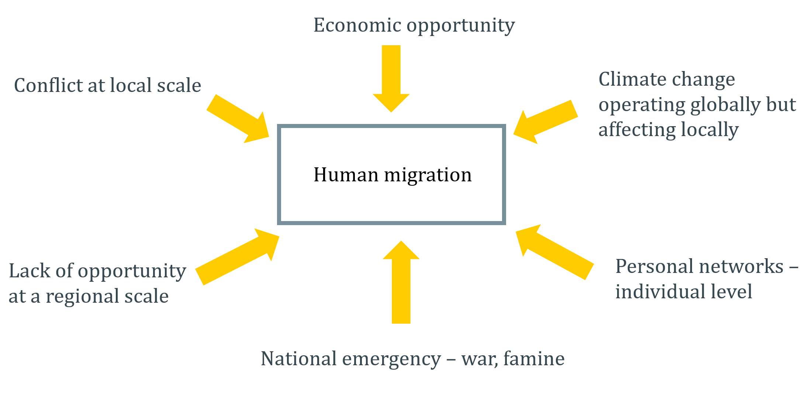

# 
Spatial Patterns and Spatial Processes

**Notebook Outline:**  
  
**Introduction Notebook (current)**
- [Introduction](#Introduction)
 - [Introduction to the project](#Introduction-to-the-project)
- [Conceptual Example](#Conceptual-examples-of-spatial-associations)
 - [New York Skyline](#New-York-Skyline-example)
 - [Human Migration](#Human-Migration-example)  

[Back to the main page](https://mehak-sachdeva.github.io/MGWR_workshop_book/)

# Introduction

***

## Introduction to the problem

The spatial data that we observe in the world around us are manifestations of underlying spatial processes. To understand why things are the way they are and how they work, we often model estimates of the spatial processes that affect the spatial patterns we observe. The spatial associations or relationships that we model between spatial processes and pattern data help inform on the spatial processes which cannot be directly observed.

# Conceptual examples of spatial associations

***

## New York Skyline example

***

Above is a cross-sectional view of the Manhattan skyline. As we can observe, downtown and midtown have a heavy concentration of high-rise buildings while the areas between the two have mostly mid-rise buildings. This is clearly an observed pattern which is possibly a result of many underlying processes that make construction of higher buildings more viable in some areas compared to others.

#### Underlying processes affecting density of high-rises in Manhattan

On a closer and deeper look into the geography of Manhattan it can be seen that the bedrock of the borough is a major driver in the city's uneven density of high-rise buildings. In this simple example we see how the sub-strata of Manhattan, **a spatial process** otherwise invisible, manifests itself into the defining skyline of the city, **the observed spatial pattern**. Such associations are often helpful to model in order to understand what forms and affects the spatial data we observe in the world.

***

## Human Migration example

***

Migration is a complex social phenomenon and is often a result of many processes, often operating at different spatial scales. For example, if a massive movement of people from one city to another is observed and we are interested in understanding what could be leading to the displacement, trying to model the processes that could be affecting it would be a good approach. For instance, a political conflict at a local scale could be forcing people to move out of a city, or lack of economic opportunity due to restrictive policies at the regional scale could be affecting it. Or something even more complex such as climate change which is a global phenomena could be leading to either or both of these issues and affecting human migration. 

This example, brings to the forefront the issue of **spatial scale of processes** that affect the pattern we observe. There is no way of understanding human migration if processes operating at different scales are not considered and the scales at which the processes most affect the pattern are unknown. This is true for most of the complex phenomena we observe in the world.
