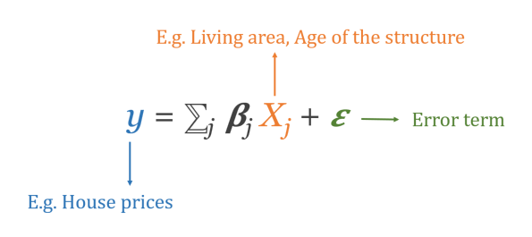
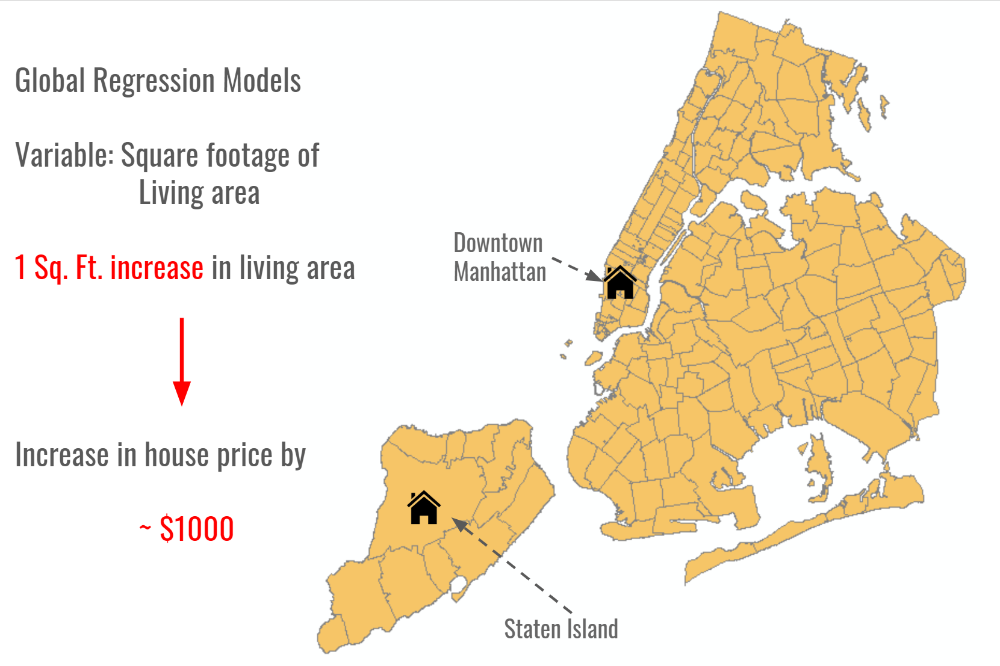
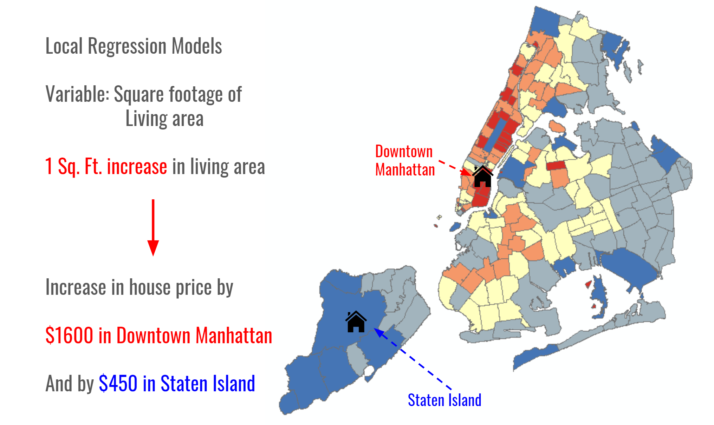

# 
Regression Models - The why and the how 

**Notebook Outline:**  
  
**Regression Models**
- [Introduction](#Introduction)
- [Hedonic House Price Models](#Hedonic-House-Price-Models)
- [Spatial Dependency and Heterogeneity](#Spatial-Dependency-and-Heterogeneity)   

[Back to the main page](https://mehak-sachdeva.github.io/MGWR_workshop_book/)

# Introduction

***

Models often used to estimate relationships between processes and how they affect the spatial data we observe in the world are broadly classified under the umbrella of **regression**. 
Let's jump right into the problem we are going to work on in this workshop and understand the concepts of regression while working through it. 

# Hedonic House Price Models

***

Since the value of the attributes of a housing unit cannot be directly measured, a method called the hedonic modeling is applied to a housing unit price such that it could be decomposed into estimated prices for various characteristics - structural, neighborhood and locational. A typical house price model can be written as:

The *Xs* are the **independent variables** that affect the dependent variable *y* or **observed patterns** with the magnitude and direction modeled by the *Betas* which are the measure of **processes** affecting the dependent variable. These are the coefficient estimates that define how much and in what direction these processes affect the pattern. 

For example, in the equation above if the beta assumes a value of + 5, this would be interpreted as the change in house price expected with an increase of living area by one unit. Consquently, if we have house price data for a city, we can easily understand how increase in living area and other such attributes of a housing unit would affect house prices in the region. 

**However, can you see the obvious limitation in using this equation for the data of an entire city?**

# Spatial Dependency and Heterogeneity

***

In the equation above, the betas or the measure of processes affecting the patterns are averages across the entire study area!
This would suggest that an increase in living area of a housing unit would affect the house price of the unit by the exact same amount no matter where the unit is located in the city. Is that a fair assumption?

**For instance, would you expect the size of a housing unit to have the same marginal cost in Manhattan as compared to that in Staten Island?**

***

 #### **Perhaps, not.**  

Spatial phenomenon exhibit spatial heterogeneity that is, we expect values to be higher in some places and lower in others. In the context of house prices in a city for example, housing units with the same structural characteristics are valued differently in different areas of a city. This would then imply that the same stimulus across a city such as an increase in living area of a housing unit, would affect the housing cost differently in different areas. For example, a more accurate map of the marginal cost of living area in New York City would be as below - where adding a unit square feet of space in downtown Manhattan would increase the housing price by a lot more than that in Staten Island. 

***

*Please note, the mapped estimates below are only representational.*
